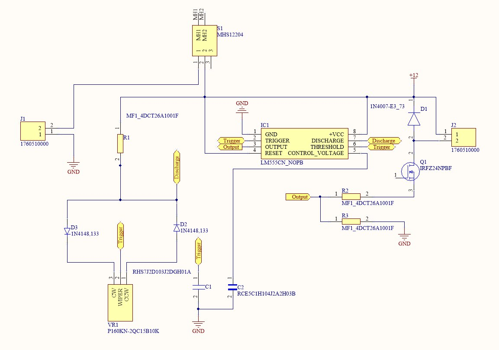
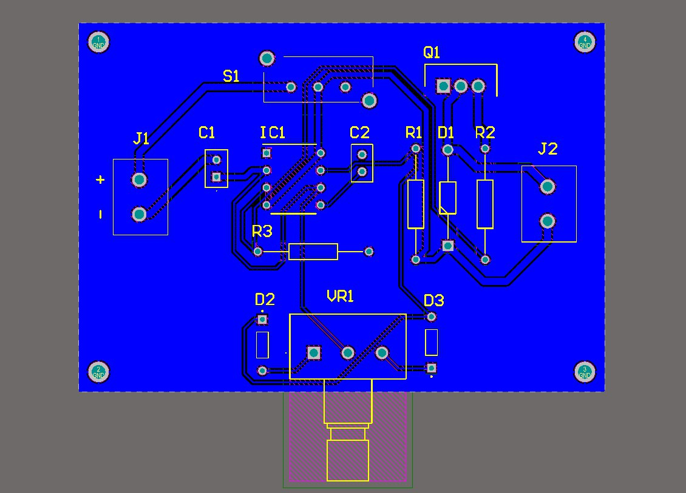
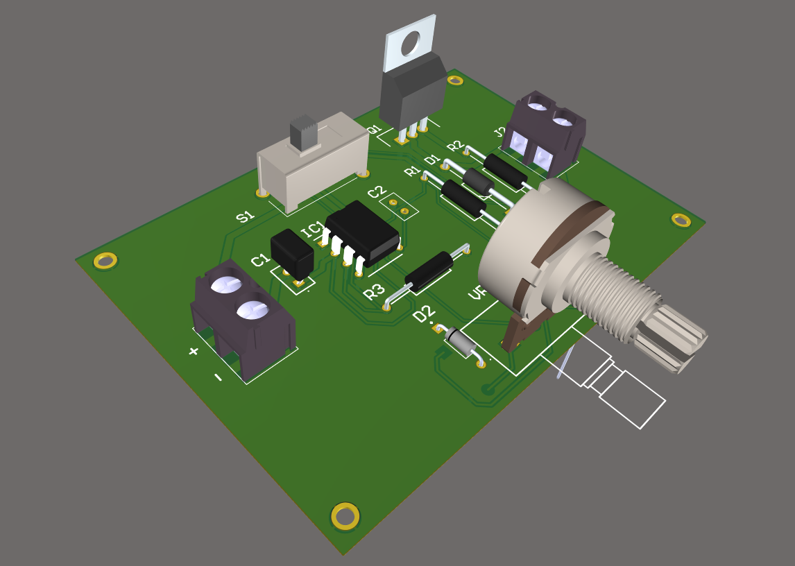
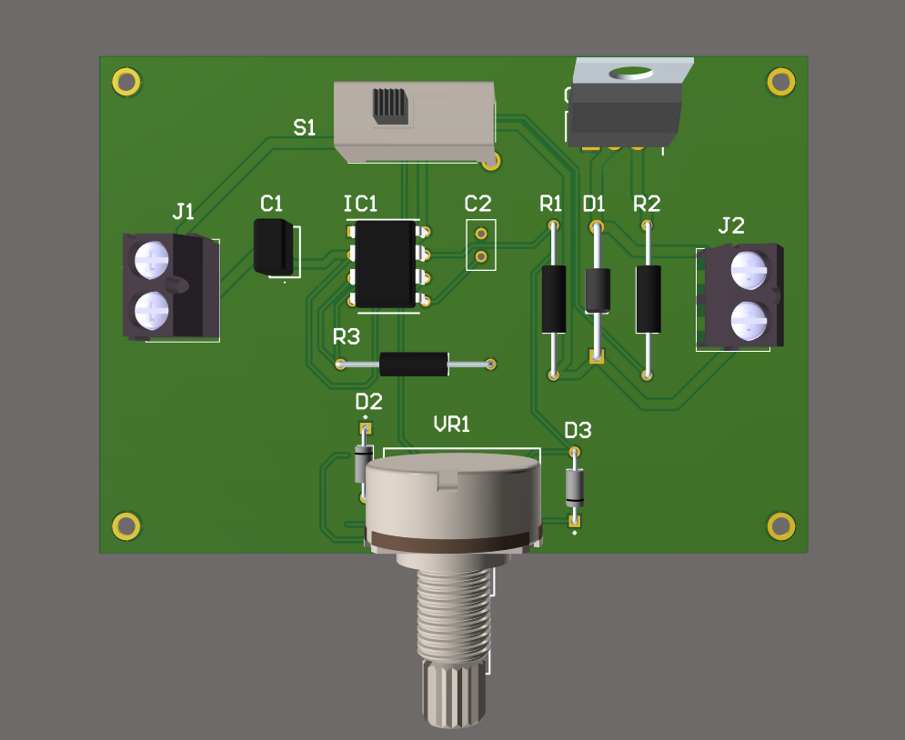

# Control de Velocidad con LM555 en Altium Designer

Este repositorio contiene los archivos de diseño para un **control de velocidad** basado en el popular circuito integrado **LM555**. El proyecto fue desarrollado en **Altium Designer** y es una solución robusta y versátil para controlar la velocidad de un motor de corriente continua (DC), actuadores o la intensidad de una carga a través de la modulación por ancho de pulso (**PWM**).

## 📝 Descripción del Proyecto

El circuito utiliza el **LM555** configurado como un multivibrador astable para generar una señal PWM. Un **MOSFET (IRFZ24NPBF)** se encarga de conmutar la carga (un motor, por ejemplo) con la señal PWM generada, permitiendo un control preciso de la velocidad. El diseño incluye un potenciómetro para ajustar el ciclo de trabajo de la señal, lo que a su vez controla la potencia entregada a la carga. Este proyecto es una excelente base para aplicaciones de robótica, automatización o proyectos educativos que requieran un control de motor simple y confiable.

### Características Clave

* **Control PWM:** Utiliza el LM555 para generar una señal de modulación por ancho de pulso.
* **Control de Velocidad:** Permite ajustar la velocidad de un motor DC o la intensidad de una carga.
* **Desarrollado en Altium Designer:** Incluye archivos de esquemático (`.SchDoc`) y de PCB (`.PcbDoc`).
* **Componentes Robustos:** Diseñado con componentes comunes y confiables.

---

## ⚙️ Lista de Componentes

A continuación, se presenta la lista detallada de los componentes necesarios para construir este proyecto.

| Designator | Comment | Description | Footprint | Quantity |
| :--- | :--- | :--- | :--- | :--- |
| C1 | 0.22uF | Capacitor Polarised | CAPPRD200W52D500H1250 | 1 |
| C2 | 0.1uF | Capacitor | RDER71E104K0P1H03B | 2 |
| C3 | 10uF | Capacitor Polarised | CAPPRD200W55D500H1250 | 1 |
| D1 | SD103A-TR | Schottky Diode | DIOAD950W60L350D150 | 1 |
| D2, D3 | 1N4148,133 | Diode Standard 75V 200mA Surface Mount SOD-523F | DIOAD753W49L380D172B | 2 |
| IC1 | LM555CN_NOPB | Integrated Circuit | DIP794W53P254L959H508Q8N | 1 |
| J1, J2 | 1760510000 | Connector | 1760510000 | 2 |
| Q1 | IRFZ24NPBF | MOSFET (N-Channel) | TO254P469X1042X1967-3P | 1 |
| R1, R2, R3 | MF1_4DCT26A1001F | Resistor | RESAD1630W60L710D230 | 3 |
| S1 | MHS12204 | Switch | MHS12204 | 1 |
| VR1 | P160KN-2QC15B10K | Variable Resistor | P160KN2QC15B10K | 1 |

---

## 📸 Imágenes del Proyecto

### 1. Esquema Eléctrico

### 2. PCB

### 3. Vista Ortogonal

### 4. Vista Superior

---

## 🚀 Cómo usar este repositorio

1.  **Clona el repositorio:** `git clone https://github.com/ingwplanchez/altium-speed-controller.git`
2.  **Abre el proyecto en Altium Designer:** Navega a la carpeta del proyecto y abre el archivo `.PrjPcb`.
3.  **Visualiza y modifica:** Explora el esquemático y la PCB. Si lo deseas, puedes generar los archivos de fabricación (Gerber) para producir tu propia placa.